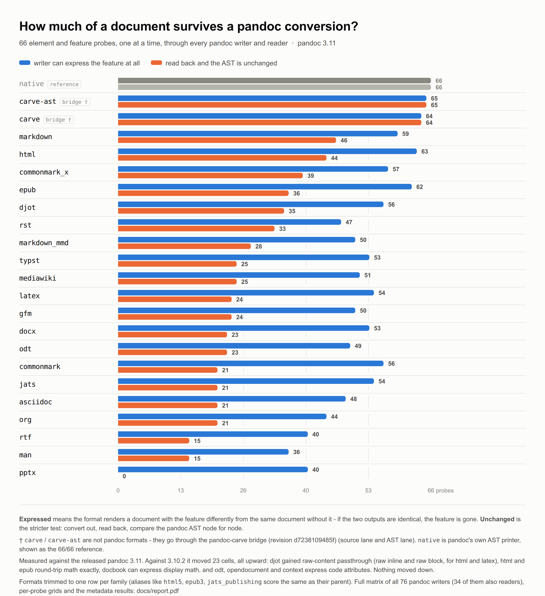

# pandoc-format-fidelity

How much of a document survives a pandoc conversion, measured rather than guessed.

Each probe is a pair of pandoc ASTs differing in exactly one feature, run through
every writer pandoc ships and read back by every reader. The output is a grid saying,
per format and per feature, whether the format can express it at all and whether it
comes home unchanged.



Report: [`docs/index.html`](docs/index.html) · [`docs/report.pdf`](docs/report.pdf) ·
Dashboard: [`docs/dashboard.html`](docs/dashboard.html)

## The method

Each probe is a **pair** of ASTs - a `rich` one that uses a feature and a `degraded`
one that does not - and the question is what pandoc does with the two of them:

| lane | question | verdicts |
|---|---|---|
| writer (`src/run_matrix.py`) | is `write(rich)` byte-identical to `write(degraded)`? | `diff` = expressed, `same` = cannot express |
| round-trip (`src/run_roundtrip.py`) | is `read(write(rich))` the same AST as `read(write(degraded))`? | `diff` = survives, `same` = lost |
| exact (`src/run_exact.py`) | does `read(write(rich))` equal `rich`? | `exact` / `canonical` / `lossy` |
| metadata (`src/run_meta.py`) | which of ten metadata shapes survive standalone? | `exact` / `partial` / `lost` |
| Carve round-trip (`src/run_carve_rt.mjs`) | does a Carve source file come back as itself? | `exact` / `equivalent` / `respelled` / `lossy` |

**The first two lanes never compare anything against the input.** Both sides go
through the same writer with the same options, so whatever canonical styling that
writer applies lands on both and cancels. A `same` verdict means pandoc emitted
literally the same bytes for two different ASTs. Input formatting cannot produce that.

**The exact lane is the one where canonicalization matters**, so it reports three
verdicts instead of two. `canonical` means the content came back but the writer
restyled it. What gets folded is listed in `common.canonical()` and is deliberately
short:

- `AlignLeft` == `AlignDefault` - a default-aligned column renders left
- a measured `ColWidth` == `ColWidthDefault` - the number is the writer's arithmetic
- raw `tex` == raw `latex` - alias for one target
- header ids invented by `--auto_identifiers` are dropped

Counting those as loss overstates pandoc's markdown by eleven probes. Counting
them as exact would hide real precision loss, like a column width rounded to the grid.
Hence a column each.

Two settings are load-bearing and were both bugs before they were settings:

- `--wrap=preserve` on every writer. Without it a wrapping writer turns a `SoftBreak`
  into a space and the probe reads as "cannot express" a distinction the format
  handles fine.
- `--resource-path=fixtures` on every writer, and the same image handed to
  `pandoc server` in the request. An image pandoc cannot resolve makes epub leave the
  src untouched, which round-trips to a **false** `exact`; when it resolves, epub
  embeds it and rewrites the src to `media/file0.png`, which is the honest answer.

## Which pandoc, measured when

Every lane run writes `results/run.json` first: the pandoc version, whether it
is the version `scripts/fetch-pandoc.sh` pins, the UTC date, the commit, and the
platform.

A release identifies itself well enough; a nightly does not. When the caller
knows which upstream build it fetched, it says so through `PANDOC_SOURCE_RUN`,
`PANDOC_SOURCE_DATE`, `PANDOC_SOURCE_REF` and `PANDOC_SOURCE_URL`, and the stamp
records it alongside the banner. If the build names itself after a different day
than the run it came from, the stamp says `stale_banner`, the dashboard leads
with it, and the nightly job fails: a night measured against a build whose
identity is not settled is worse than a night not measured, because the delta
reads as authoritative either way. That is not hypothetical - on 2026-09-08 the
watch measured a build calling itself `3.10.2-nightly-2026-08-16` pulled from an
upstream run created that morning, whose artifact holds a `2026-09-08` build.
Where the selection went wrong is not established; the job recorded nothing but
the banner, which is the hole this closes. Nothing quotes those by hand any more - the report's heading and
footer, and every figure on the dashboard, are substituted from that file. The
version in the heading used to be a literal, so a rerun against a different
build published the old number over the new figures.

## Deltas and thresholds

`src/delta.py` compares two results directories as **verdicts**, not as text:

```
make delta BASELINE=results-baseline CANDIDATE=results PROFILE=pin
```

Every cell that moved is reported as `format · probe · from -> to`, classified
against the ranking in `src/verdicts.py` - each lane declares an order over its
verdicts, so a cell that drops rank is a regression and one that rises is an
improvement. `thresholds.json` decides whether that passes, and the exit code is
the gate. Two profiles, because the two comparisons are not the same question:

- **`pin`** - the repo's own results against the pinned pandoc. Nothing may move.
- **`nightly`** - the watch on pandoc's nightly build. Presentation-class
  movement is expected and tolerated up to a cap; content-class movement never is.

`allow` in the same file exempts cells whose verdict depends on the machine
rather than on pandoc - the `pdf` row needs a TeX engine - with the reason
written down rather than quietly subtracted.

A cell that **disappeared** is not a regression (there is no verdict to rank),
but lost coverage still breaches on its own. A lane file
that failed to be written, a `BASELINE` that points at nothing, or a format the
candidate no longer measures all leave the gate comparing less than it thinks,
and all three used to report a clean run. Opt-in lanes are exempt: not running
one is a choice.

`--record results/history.jsonl` appends one summary line per run, which is what
the dashboard's trend line reads.

The delta earned its place on its first real run: it caught 33 `pptx` cells that
had turned into errors, which turned out to be `pandoc server` answering 503
under eight concurrent workers rather than anything about pptx. The writer lane
now retries a transient failure instead of recording it, because an
intermittent `err` reads as a regression and makes the gate useless.

## Running it

```
make          # fetch the pinned pandoc, run every lane, rebuild the report
make lanes    # just the measurements
make report   # the report and the dashboard from existing results/
make dashboard# just the dashboard (reads results/ only, no pandoc needed)
make delta    # what moved between two results sets, gated by thresholds.json
make check    # unit tests, the severity rubric, JSON sanity
make controls # the two controls the report quotes (see src/controls.py)
```

`make controls` is not part of the grid. It checks that the writer lane's comparison
means what the report claims: every writer is asked to emit the same document twice
(75 of 76 are byte-identical; `pdf` errors, so it cannot be checked), and the
`--wrap=preserve` effect is counted on the `softbreak` probe.

Requires python3, node (only for the Carve lanes) and curl. The pinned pandoc is
fetched into `vendor/` by `scripts/fetch-pandoc.sh`; nothing is installed globally.
Results are committed under `results/`, so a rerun shows up as a reviewable diff.

To measure a different pandoc:

```
PANDOC_VERSION=3.11 ./scripts/fetch-pandoc.sh && make lanes report
PANDOC=/path/to/pandoc make lanes report      # e.g. a nightly build
```

## Which formats are in the round-trip lanes

Formats pandoc can both write and read, minus (see `src/formats.py`):

- `biblatex`, `bibtex`, `csljson` - bibliography databases, so a probe about tables
  says nothing about them
- `json`, `xml` - pandoc's own AST serializations, lossless by construction, and
  `native` already sits in the chart as the reference row

## Severity

Counting probes treats a dropped footnote body and a dropped column width as one
event each. `src/severity.py` classifies every probe by what is missing from the
page when it does not survive:

| class | weight | what is gone |
|---|---|---|
| `content` | 3 | text or a referent, with nothing left on the page saying so |
| `structure` | 2 | every character survived, the document's shape did not |
| `presentation` | 1 | styling, a hint or a measurement; words and shape intact |

The weighted score on the dashboard forgives the `canonical` verdict, because the
question it asks is whether the content came home rather than whether the writer
restyled it. The per-class columns beside it are the point: two formats reach the
same percentage by losing very different things.

Two calls are worth arguing with, and are marked in the file: `strikeout` and the
scripts are `structure` rather than `presentation`, because what survives asserts
something else - struck text reads as current, and `x^2` flattened to `x2` is a
different number. `table_caption`, `table_foot` and `figure` are `content`,
because their degraded side has no caption or footer row at all, so a `same`
verdict means those words were never written.

Every probe must appear in the table; `make check` fails otherwise, so adding a
probe forces the decision rather than defaulting it.

## Carve

Two separate measurements, both **opt-in** - `make` alone produces a pandoc-only
grid.

`carve` and `carve-ast` are **not** pandoc formats. They are the two lanes of the
[pandoc-carve](https://github.com/markup-carve/pandoc-carve) bridge, put through the
identical probes:

```
make carve CARVE_BRIDGE=../pandoc-carve/dist/index.js
```

The round-trip lane asks the other question, the one a Carve author actually has:
**I wrote this in Carve and exported it - what comes back?** A pandoc probe cannot
ask it, because the pandoc AST has no node for an admonition, a task list, a
highlight or an editorial mark, so those never appear in the probe set at all.
The inputs are Carve source files under `fixtures/carve/`, one construct each,
round-tripped through the bridge alone and through each of the export formats
the lane lists (`CARVE_RT_FORMATS` overrides them):

```
make carve-rt CARVE_BRIDGE=../pandoc-carve/dist/index.js
```

It reports one verdict more than the pandoc side. Between `equivalent` (the bytes
differ, the Carve AST does not) and `lossy` sits **`respelled`**: the AST differs
and the rendered HTML is identical, so the document is spelled differently and
reads the same. A `[^1]` reference footnote coming back as an inline `^[...]`, a
`.` auto-number coming back as `1.`, a `::: >` container coming back as a `>`
quote. Calling those loss would be wrong; calling them equivalent would hide that
the source no longer matches what the author wrote.

One case to know before reading those numbers: a dropped `%%` comment lands as
`respelled`, because a comment renders to nothing and the HTML really is
identical. The loss is real for the author and invisible to the reader, so it
shows up in the lane's `warnings` instead, where the bridge says plainly that it
dropped it.

The fixtures are written by `scripts/write-carve-fixtures.py` so their bytes are
exact, and they lint clean against `@markup-carve/carve`'s own linter.

## Caveats

- A `diff` in the writer lane means the format distinguishes the two documents, not
  that it distinguishes them *well*. Escaping to raw HTML counts.
- Some cells are genuine pandoc round-trip errors rather than losses. Three are
  isolated: `muse` writes a header id its own reader rejects, and `typst` emits a
  heading its own reader rejects. `opml` is the bulk of them - its reader rejects 64
  of the 66 probes, because it serializes a heading outline and not a document.
- `pdf` reads 0 everywhere because the writer needs an external TeX engine that is not
  installed here, so every pdf conversion errors. That row measures this machine, not
  the format.
- The probe set covers single features in isolation. Interactions between them are
  not measured.
- The Carve round-trip lane compares blocks, and only the metadata keys the source
  document had. The epub reader invents a date, a uuid and a language on every
  read; carrying those back would put three frontmatter lines the author never
  wrote in front of every fixture and read as loss. The same lane strips the
  container chrome epub, fb2 and ipynb wrap a document in, exactly as the exact
  lane does - before that, epub scored 0 of 40 for a reason that had nothing to do
  with epub.
- The dashboard's date is the date of the last **committed** measurement, not of
  the last build. The two pages under `docs/` quote the run they describe, so they
  are regenerated and committed together with `results/`.
